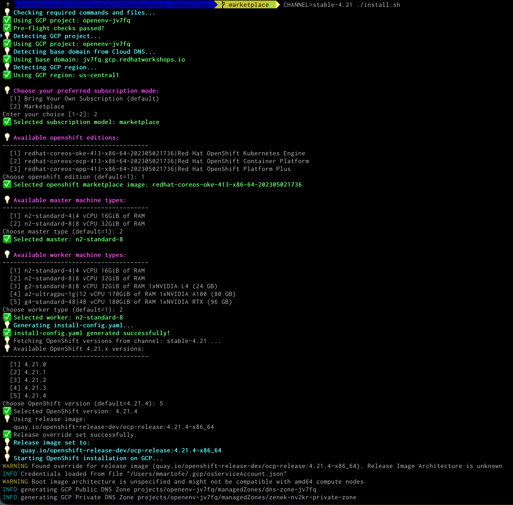

# 🛠️ Red Hat OpenShift Easy Install on GCP

[](https://github.com/mmartofel)
[](https://www.openshift.com)
[](LICENSE)

---

**OCP Easy Install on GCP** is a set of scripts that automate the installation of **OpenShift 4.x** clusters on **GCP**.  
It simplifies the setup process by handling instance type selection, pull secrets, SSH keys, and generating the OpenShift `install-config.yaml`.

---

## 💡 Features

- ✅ Automatic detection of **GCP region** and **base domain**
- ✅ Pre-flight checks for **openshift-install**, GCP credentials, SSH keys, and pull secrets
- ✅ Interactive selection of **master and worker instance types**
- ✅ Easy selection of **OpenShift versions** from the stable channel
- ✅ Automatic generation of **install-config.yaml** with all required fields
- ✅ Optional **release image override** with architecture detection
- ✅ Fully **colorful and user-friendly output** with icons

---

## 🆕 New Features

- **Offer Type Selection**: Choose between "Bring Your Own Subscription" and "Marketplace" installation modes.
- **Marketplace SKU Selection**: Interactive selection of OpenShift SKUs for marketplace installations of:
    - Red Hat OpenShift Kubernetes Engine (OKE)
    - Red Hat OpenShift Container Platform (OCP)
    - Red Hat OpenShift Platform Plus (OPP)

---

## ⚙️ Requirements

- Bash 3+  
- GCP CLI (gcolud) configured with appropriate credentials  
- OpenShift Installer (matching desired OpenShift version, for the time of creation of that repo 4.20)  
- Pull secret file from [Red Hat OpenShift](https://cloud.redhat.com/openshift/install)  
- SSH key for cluster access (or you can generate it with ./ssh/gen.sh)

if you missed anything you will be guided by error handling messages

---

## 🚀 Installation Steps

1. **Clone the repository:**

```bash
git clone https://github.com/mmartofel/ocp-easy-install-gcp.git
cd ocp-easy-install-gcp
```

2. **Set optional environment variables:**

```bash
CLUSTER_DIR=./config
CLUSTER_NAME=zenek
BASE_DOMAIN=example.com
PULL_SECRET_FILE=./pull-secret.txt
SSH_KEY_FILE=./ssh/id_rsa.pub
GCP_PROJECT_ID=my-gcp-project
GCP_REGION=us-central1
CHANNEL=stable-4.21
```

or do nothing and stay with default set at install.sh

3. **Configure your access to GCP**

```bash
./gcp_configure.sh
```

4. **Run the installation script:**

```bash
./install.sh
```



Follow the interactive prompts to:

1. Choose your subscription mode:
   - Bring Your Own Subscription (default)
   - Marketplace
2. If "Marketplace" is selected, choose the OpenShift SKU for master and worker nodes.
3. Select master and worker instance types.
4. Choose the OpenShift version.

The script will generate `install-config.yaml` and start the cluster installation. Once installation is finished, you will see all the information required to connect and use your newly installed Red Hat OpenShift cluster. Enjoy!

5. **Access your cluster:**

for example using oc CLI

```bash
export KUBECONFIG=./config/auth/kubeconfig
oc status
```

or via brawser as of an info passed at the end of paragraph 4 

## 🗂️ Directory Structure

```graphql
.
├── gcp_configure.sh         # Script to configure GCP access
├── images/                  # Directory for images
├── install.sh               # Main installation script
├── instances/               # Instance type definitions
│   ├── marketplace          # Marketplace os images definitions
│   ├── master               # Master instance definitions
│   └── worker               # Worker instance definitions
├── ssh/                     # SSH key for nodes
│   ├── gen.sh               # Script to generate SSH keys
└── uninstall.sh             # Script to uninstall OpenShift cluster
```

You need to provide your own `gcp_service_account.json` containing your GCP service account credentials and pull secret as `pull-secret.txt` in the root of the repository. Generate your own SSH key with `./ssh/gen.sh` or use existing one. Also openshift-install binary must be in this directory, you can download it from [Red Hat OpenShift](https://cloud.redhat.com/openshift/install) matching your platform you ar einstalling from and OpenShift version.

## 🖌️ Customization

You can modify:

```
./instances/master
./instances/worker
```

files content to update available RCP instance types, I just provided a few tested, feel free to put your own you need at your cluster.

Here is a great place to use GPU equited instances to start your jouney with AI, best would be Red Hat OpenShift AI ;-)

## ⚠️ Notes

The installer supports automatic OpenShift version selection from the stable channel (e.g., stable-4.20). You can modify your channel over time, or propose how can we improve that functionality together.

The script includes pre-flight checks to prevent common errors.

Custom release image override is used to start from most recent or just purposly chosen patch version at the start to save time for 'after install' upgrades chain.

## 📖 References

[OpenShift Installing on Google Cloud](https://docs.redhat.com/en/documentation/openshift_container_platform/4.20/html/installing_on_google_cloud/index)

## 🤝 Contributing

Feel free to submit issues, pull requests, or suggest new features.
This project is meant to simplify Red Hat OpenShift installations at GCP for any users and is community-driven.

## ⚡ License

This repository is licensed under the MIT License. See LICENSE for details.