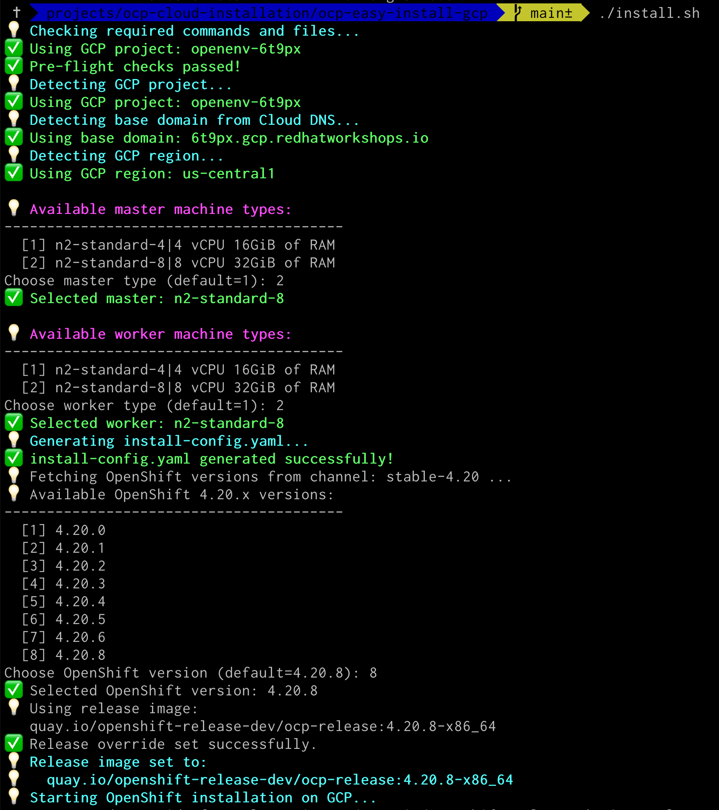

# 🛠️ Red Hat OpenShift Easy Install on GCP

[](https://github.com/mmartofel)
[](https://www.openshift.com)
[](LICENSE)

---

**OCP Easy Install on GCP** is a set of scripts that automate the installation of **OpenShift 4.x** clusters on **GCP**.  
It simplifies the setup process by handling instance type selection, pull secrets, SSH keys, and generating the OpenShift `install-config.yaml`.

---

## 💡 Features

- ✅ Automatic detection of **AWS region** and **base domain** (Route53)
- ✅ Pre-flight checks for **openshift-install**, AWS credentials, SSH keys, and pull secrets
- ✅ Interactive selection of **master and worker instance types**
- ✅ Easy selection of **OpenShift versions** from the stable channel
- ✅ Automatic generation of **install-config.yaml** with all required fields
- ✅ Optional **release image override** with architecture detection
- ✅ Fully **colorful and user-friendly output** with icons

---

## ⚙️ Requirements

- Bash 3+  
- GCP CLI (gcolud) configured with appropriate credentials  
- OpenShift Installer (matching desired OpenShift version, for the time of creation of that repo 4.20)  
- Pull secret file from [Red Hat OpenShift](https://cloud.redhat.com/openshift/install)  
- SSH key for cluster access (or you can generate it with ./ssh/gen.sh)

if you missed anything you will be guided by error handling messages

---

## 🚀 Installation Steps

1. **Clone the repository:**

```bash
git clone https://github.com/mmartofel/ocp-easy-install-gcp.git
cd ocp-easy-install-gcp
```

2. **Set optional environment variables:**

```bash
export AWS_PROFILE=default
export CLUSTER_NAME=zenek
export CLUSTER_DIR=./config
export BASE_DOMAIN=example.com
```

or do nothing and stay with default set at install.sh

3. **Run the installation script:**

```bash
./install.sh
```



Follow the interactive prompts to choose master and worker instance types, and OpenShift version.
The script will generate install-config.yaml and start the cluster installation. Once installation is finished, at the end of an output you see all the informations required to connect and use your newly installed Red Hat OpenShift cluster. Enjoy!

4. **Access your cluster:**

for example using oc CLI

```bash
export KUBECONFIG=./config/auth/kubeconfig
oc status
```

or via brawser as of an info passed at the end of paragraph 4 

## 🗂️ Directory Structure

```graphql
.
├── install.sh                # Main installation script
├── instances/                # Instance type definitions
│   ├── master
│   └── worker
├── pull-secret.txt           # OpenShift pull secret (user-provided)
├── ssh/                      # SSH key for nodes
│   └── id_rsa.pub
└── config/                   # Generated OpenShift config directory
    └── install-config.yaml
```

## 🖌️ Customization

You can modify:

```
./instances/master
./instances/worker
```

files content to update available AWS instance types, I just provided a few tested, feel free to put your own you need at your cluster.

Here is a great place to use GPU equited instances to start your jouney with AI, best would be Red Hat OpenShift AI ;-)

## ⚠️ Notes

The installer supports automatic OpenShift version selection from the stable channel (e.g., stable-4.20). You can modify your channel over time, or propose how can we improve that functionality together.

The script includes pre-flight checks to prevent common errors.

Custom release image override is used to start from most recent or just purposly chosen patch version at the start to save time for 'after install' upgrades chain.

## 📖 References

OpenShift Installation Guide

AWS OpenShift Installer

## 🤝 Contributing

Feel free to submit issues, pull requests, or suggest new features.
This project is meant to simplify Red Hat OpenShift installations at AWS for any users and is community-driven.

## ⚡ License

This repository is licensed under the MIT License. See LICENSE for details.